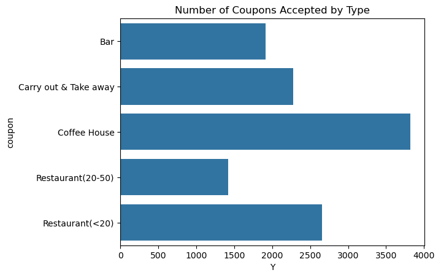
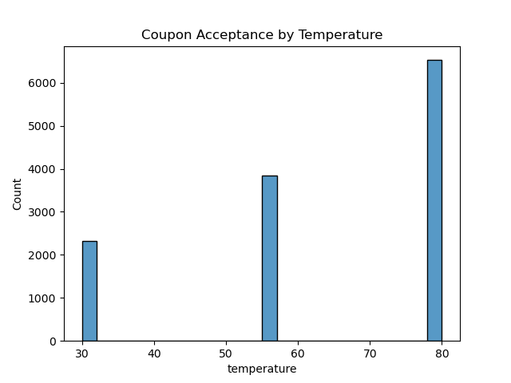
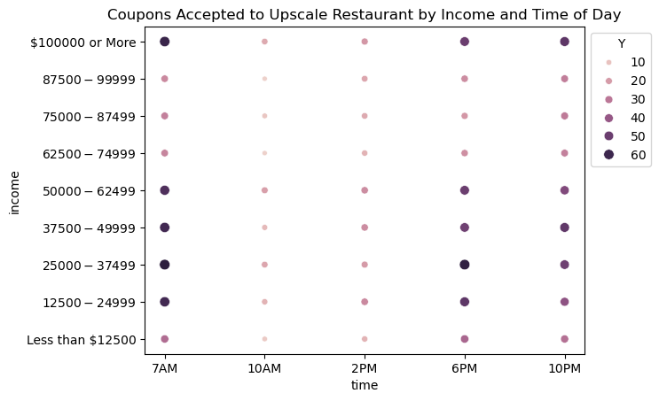

# Introduction
This is a homework assignment for an AI/ML class from UC Berkeley, 2025.  
Required Assignment 5.1

Jupyter Notebook: https://github.com/dshavoc/aiml-assignment-5.1/blob/master/assignment5_1.ipynb

# Summary of Findings

## Data Cleaning
There was a `car` column that was less than 1% populated, so that was dropped.
There were 605 rows that contained nulls in remaining columns, so those were dropped, leaving 12,079 rows.

## Guided Analysis
* 56.8% of total coupons were accepted
* The most commonly accepted coupons were offered from coffee houses and budget-friendly restaurants.

* Most coupons were offered in clement temperature. This is likely due to population centers favoring locations of those temperatures, and not an indication of likelihood of acceptance given a cooler temperature, but this question was not explored.

* Investigation of bar coupons
    * Drivers accepted 41.2% of all bar coupons.
    * The acceptance rate for those who went to a bar 4+ times/mo was 2.044 times higher than for those who went less often.
    * Drivers who go to a bar more than once a month and are over the age of 25 accept a coupon at a rate of 69% while all others accept a coupon at a rate of 33.8%. The former are 2.04 times more likely to accept the coupon. Big difference!
    * Drivers who go to a bar more than once per month, and had an adult passenger, and weren't in farming, fishing, nor forestry, accepted bar coupons at a rate of 70.9% compared to everyone else at a rate of 29.8%. The former are 2.38 times more likely to accept the coupon. Big difference!
* Drivers who go to a cheap restaurant more than four times per month and have an income less than $50k accepted bar coupons at a rate of 40.5%, compared to everyone else at a rate of 41.5%. Almost no difference.

## Independent Analysis

### Visualization

**Pair Plot**  
An attempt was made to visualize the relationship between temperature, gender, age, and income on coupon acceptance with a pair plot.

> Finding: It was concluded that the discretization of the data is not well-lent to a Pair Plot as all the data points stacked on one another.

**Group Location by Acceptance**  
Location-related columns were selected, and the rows grouped by coupon acceptance. Each group was averaged, and a bar plot was generated.

> Finding:  
> * Given a coupon was accepted, ~57% of them were more than 5 minutes away, ~30% were more than 15 minutes away, and only 5% were more than 25 minutes away.
>    * 100% - 57% = 43% of accepted coupons were within 5 miles away.
>    * 57% - 30% = 27% of accepted coupons were 5 to 15 miles away.
>    * 30% - 5% = 25% of accepted coupons were 15 to 25 miles away.
> * It's difficult to read much useful information from a group by acceptance. See Independent Investigation Step 3 for more informative grouping.

**Group Coupon by Acceptance**

The coupon and acceptance columns were selected, rows were grouped by coupon type, and the acceptance of those groups were summed.

This was a different computational method that produces the same information as in the first figure in Guided Observations.

> Finding: The most coupons were accepted from coffee houses by a wide margin, and budget restaurants came in second.

### Targeted Investigation

#### Driver with Kids: take-out or dine-in at an upscale restaurant?

> Finding:  
> * For drivers with child passengers, the acceptance rate for take-out coupons was 69.7%,
compared to the acceptance rate for expensive dine-in coupons of 36.9%.
> * Those drivers were 1.89 times more likely to accept a take-out coupon.

#### Coupons to an upscale restaurant by income and time of day

Coupons to upscale restaurants ($20-$50) were selected, then grouped by time of day and driver income. Acceptance was summed up within those categories and plotted.

> Finding:
> * There's much higher coupon acceptance during breakfast, dinner, and late night.
> * There is higher coupon acceptance by the wealthy (over \$100k) and the lower-middle class brackets, and less by the upper-middle class brackets and the bracket below \$12.5k.
>    * The large numbers of acceptance by wealthy may owe to sample bias: more respondents in that open-ended category than in the narrower ones.
> * The upper-middle class doesn't seem to use as many coupons.

# Next Steps and Recommendations

There are many facets of this data unexplored. The brief inquiries made and presented here barely scratch the surface.

The guided analysis asked questions about very specific combinations of data, and some of the independent analysis asked similarly specific questions. In an exhaustive analysis, these questions should be generalized to draw conclusions on the full granularity of the data, rather than merely a threshold (e.g. "those who went to a bar 4+ times") which bins the already-coarse data now into two classes. That thresholding may yield complete inferences if the data is linear--however it's clear from the findings of "Coupons to an upscale restaurant by income and time of day" that driver behavior is not linearly related to time of day nor income (the former is obvious, the latter is more nuanced).

Care should be given to reading very carefully the meaning of the data. And, specifically, what's missing from the data. It would appear, for example, that cold weather is bad for coupon acceptance. However, the data may have been collected in a warmer environment where the audience disengages in colder temperatures. Behavior may change dramatically if similar data were gathered in a different environment. But given the conditions of this data, it may also be worth investigating the most effective advertising strategies during cold weather, rather than merely writing off cold weather as a bad time to advertise. Such could realize outsized gains, if the competition writes off cold weather. Repeat the question for other non-ideal factors such as weather, education, occupation.

